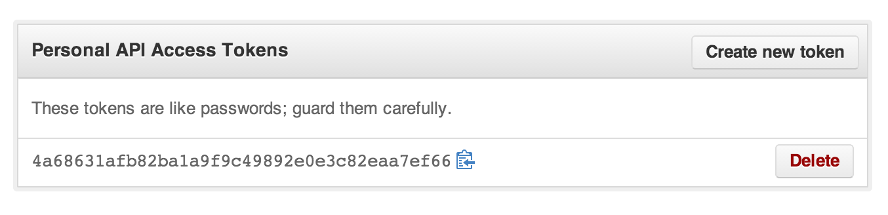
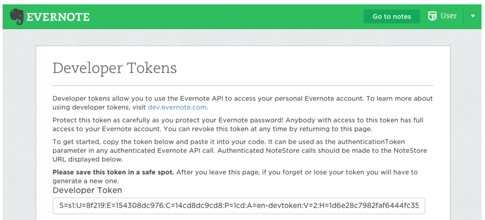

# Gist-Evernote

A Python application that sync your Github Gists and save them to your [Evernote](https://evernote.com/) notebook as screenshots. With the app, you can search your work (Jupyter notebooks, Markdown files, Python scripts, etc) all in one place with pretty result. :sunglasses: :notebook:

## Demo
A simple use case for search notebooks including `subplot`:


## Background
As a heavy Evernote user and a data scientist, I wondered won't it be wonderful to be able to search all my [Jupyter notebooks](http://jupyter.org/) directly inside Evernote. Thanks to the [OCR technology](https://help.evernote.com/hc/en-us/articles/208314518-How-Evernote-makes-text-inside-images-searchable) built by Evernote, this become possible. Without further ado, try it yourself :wink:

## Getting Started
This project is written in Python and tested only on macOS currently.
To start synchronizing your gist to Evernote, follow the instruction below to setup the application.

### Prerequisites

#### Python 2.7

```bash
python --version
Python 2.7.14 :: Anaconda, Inc.
```

This is due to [Evernote API](https://github.com/evernote/evernote-sdk-python)'s limited support of
[Python3](https://github.com/evernote/evernote-sdk-python3), but will try to migrate in near future.

#### [Chrome browser](https://www.google.com.tw/chrome/browser/desktop/index.html)

#### [Chrome driver](https://sites.google.com/a/chromium.org/chromedriver/downloads)
Latest version is recommended. After downloading, put the driver under path like `/usr/local/bin`.  

Check whether the driver is in the path:
```bash
ls /usr/local/bin | grep chromedriver
chromedriver
```

Make sure the path where the driver locate is accessible via `$PATH` environment variable:

```bash
echo $PATH
... :/usr/local/bin: ...
```

If the path is not included in `$PATH`, you can add the path to `$PATH` temporarily:
```bash
export PATH=$PATH:/usr/local/bin
```    

#### [Github Personal Access Token](https://github.com/settings/tokens)
To grant the app to retrieve your gists,
you have to give the app a access token. You can read more about the token [here](https://github.com/blog/1509-personal-api-tokens).

Allow following permission when creating the token:

```commandline
admin:org_hook, gist, notifications, read:gpg_key, read:public_key, read:repo_hook, repo, user
```

After creating the token, you should save the token for later usage:




#### [Evernote Developer Tokens](https://dev.evernote.com/doc/articles/dev_tokens.php)
To grant the app to create/update notes to your Evernote notebooks, create a [Production Token](https://www.evernote.com/api/DeveloperToken.action) and save for later usage.



### Installation
First clone the repo and get into the root folder:

```commandline
git clone https://github.com/leemengtaiwan/gist-evernote.git
cd gist-evernote
```

To install all the dependencies, [Conda](https://conda.io/docs/) is recommended:  

```commandline
conda env create -n gist-evernote -f environment.yaml
source activate gist-evernote
```

Or use `pip` instead:

```commandline
pip install -r requirements.txt
```

### Setup
Tell the app about your Github and Evernote tokens acquired [previously](#Github Personal Access Token):

```commandline
python setup.py
```

You will be asked to provided your tokens and the name of notebook you want your gists to be sync. Alternative, you can modify the [settings.py](settings.py) directly:

```python
GITHUB_AUTH_TOKEN = ""
EVERNOTE_PROD_TOKEN = ""
EVERNOTE_SANDBOX_TOKEN = ""
NOTEBOOK_TO_SYNC = "gist-evernote"

```

### Start to sync your gists
Finally, after input our credentials, now we can run the sync app:

```commandline
python app.py
```

If anything go well, it will start to fetch your gists,
take screenshots of them and save them as new notes in Evernote. Have a coffee before it finish :sunglasses::coffee:

To reflect modification to synced gists to Evernote, just run the app again and it will try to do its best:

```commandline
python app.py
```

## Contributing

There are still many things left to be improved. Any advice or pull request is highly appreciated.
Notes that the Python Docstrings of this repo follow
[Numpy Style](http://www.sphinx-doc.org/ja/stable/ext/example_numpy.html#example-numpy).


## Authors

* **Meng Lee** - find me at `b98705001@gmail.com`

## License

This project is licensed under the MIT License -
see the [LICENSE.txt](LICENSE.txt) for details.

## Acknowledgements

* [Github GraphQL API v4](https://developer.github.com/v4/)
* [Evernote Python SDK](https://github.com/evernote/evernote-sdk-python)

## Future Work
- 建立一個 func, 在 app 結束的時候判斷要更新系統的 sync_at 到什麼時候
    - 中途 process 被中斷啥的就更新到目前的最新的 gist 的 pushAt
    - 全部完成就使用最新的 gist 的 pushAt
    - 不管哪個，反正就